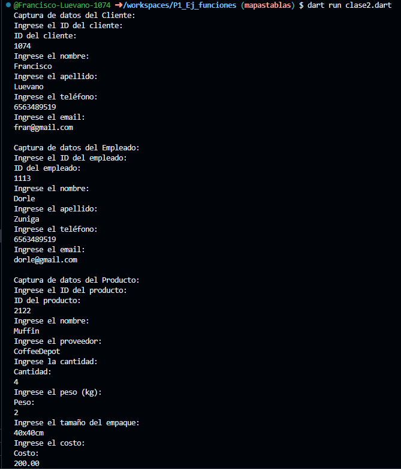
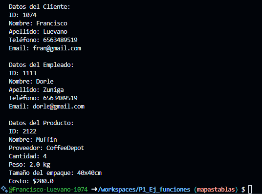

Crear una clase cliente con atributos(id_cliente, nombre, apellido, telefono, e-mail). clase empleado con atributos(id_empleado, nombre, apellido, telefono, e-mail) y clase producto con los atributos (id_producto, nombre, proveedor, cantidad, peso, tamaño_empaque, costo) una funcion captura() desde la interfaz y otra mostrardatos(), crear la instancia y utilizar los atributos y llamadas a funciones lenguaje dart.

Entrada:

Salida: 

