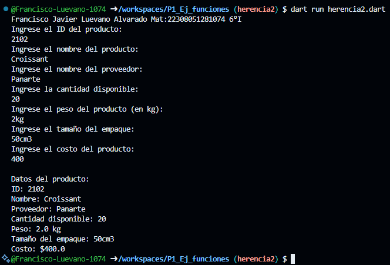

Crear la clase Producto con los atributos (id_producto, nombre, proveedor, cantidad, peso, tamaño_empaque y costo) con una función capturaDatos(), con interacción de interfaz de usuario. Crear la clase DatosVenta con herencia Producto y una función mostrarDatos().

Salida resultado

