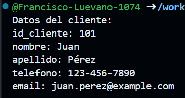
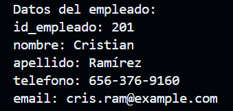
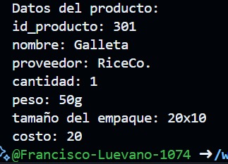

1. crear map<string, dinamic> medicamento con los siguientes key, id_cliente, nombre, apellido, telefono, e-mail. Y mostrar los datos con un for each. leguaje dart
Salida:

2. crear map<string, dinamic> medicamento con los siguientes key, id_empleado, nombre, apellido, telefono, e-mail. Y mostrar los datos con un for each. leguaje dart
Salida:

3. crear map<string, dinamic> medicamento con los siguientes key, id_producto, nombre, proveedor, cantidad, peso, tamaño de empaque y costo. Y mostrar los datos con un for each. leguaje dart
Salida:
